<style>
section {
  background-color: #fefefe;
  color: #333;
}

img[alt~="center"] {
  display: block;
  margin: 0 auto;
}
blockquote {
  background: #ffedcc;
  border-left: 10px solid #d1bf9d;
  margin: 1.5em 10px;
  padding: 0.5em 10px;
}
blockquote:before{
  content: unset;
}
blockquote:after{
  content: unset;
}

.language-java {
    background: #eeeeee ; 
}
</style>


## Le property based testing pour répondre aux questions métier 

* C'est quoi une propriété ?
* Des propriétés ? dans mon code ?
* Comment je les teste ?
* Le fonctionnel dans tout ça ? 
* La petite démonstration 

---

# Property Test Based

_"Les tests basés sur les propriétés sont conçus pour tester les aspects d'une propriété qui devraient toujours être vrais : les invariants"_

Exemple : Distributivité de la multiplication 

$$\forall a,b,c \in \Z \space \space \space a * (b+c) = a*b + a*c  $$ 

<!-- 
Z : nombres entiers relatifs

IMPORTANT : il y a  deux parties dans la définition d'une propriété : 
l'invariant et l'ensemble dans lequel il est vrais

TRANSITON : Comment on ferait pour tester une propriété avec des tests classiques ? 
-->

---
## Des propriétés dans mon application ? 

_Dans tous les systèmes il y a des propriétés mais elles ne sont pas toujours faciles à trouver._ 

Quelques Patterns

* Aller-retour 
* Commutativité
* Invariance 
* Idempotence
* Oracle

<!--
On va passer ensemble, les patterns classique des invariants qui se retrouvent dans presque tous les projets informatiques

TRANSITION : pour chaque pattern j'ai mis un schema et un exemple de test
-->
---
## Aller-retour
<style scoped>
p {
    width: 70%;
    margin: auto;
}
</style>


```java
    @Property
    boolean roundTripping(@ForAll int i) {
        return Math.log(Math.exp(i)) == i ;
    }
```

<!-- Examples :
* serialization/deserialization 
* chiffrement/déchiffrement
* write/read 
* pattern command do / undo
 -->

---
## Commutativité


<style scoped>
p {
    width: 80%;
    margin: auto;
}
</style>
```java
    @Property
    boolean commutativity(@ForAll int a, @ForAll int b) {
        return a + b == b + a ;
    }
```
<!---
* Partout des que vous faites des manipulation d'ensemble
* Recherche avec condition AND OR 
* Exclusion / filtre de données 
* Opération disjointe
--->

---
## Invariance

<style scoped>
p {
    width: 80%;
    margin: auto;
}
</style>


```java
    @Property
    boolean invariant(@ForAll List<String> list) {
        int invariant = list.size();
        Collections.sort(list);
        return list.size() == invariant;
    }
```

<!-- 
Alors pour les invariants, charcher les choses qui restent vrai après l'application d'une fonction 
* taille de liste après un tri 
* object inchangé après un appel get
* base de donnée identique après un SELECT
* la somme de deux comptes est invariante aprés un virement entre 2 comptes

-->
---
## Idempotence


```java
    @Property
    boolean idempotence(@ForAll String s) {
        return s.trim().equals(s.trim().trim());
    }
```

<!-- Examples : 
* PUT in Rest
* Insertion en base de données 
* Filtre sur un ensemble
* ajout dans un ensembre SET
-->
---

## Oracle

<style scoped>
p {
    width: 60%;
    margin: auto;
}
</style>


```java
    @Property
    boolean oracle(@ForAll @StringLength(min = 3,max = 45) String s) {
        return myVeryFastCustomTrimFunction(s).equals(s.trim());
    }
```
<!-- 
Trés utile pour le refactoring 
* vous pouvez comparer la nouvelle implémentation et l'ancienne pendant un certain temps
* vérifier plusieurs implémentation Parrallele vs Single Threaded
* vérifier plusieurs implémentation d'une interface
Quand on défini une interface, des propriétés sont implicite (tri dans une list, taille positive, si j'ajoute un élément il est dedans)
=> on peut tester contre une interface de référence

TRANSITION : Normalement là je vous ai convaicu que oui il y a des propriétés dans le code
faire du PBT à la main...

-->
---
## Tester la distributivité

```java
    // tests "classiques"
    @Test void distributivityWithO() {assert 0 * (0+ 0) == 0*0+0*0;}
    @Test void distributivityWith1() {assert 1 * (1+ 1) == 1*1+1*1;}
    @Test void distributivityWithO10() {assert  0 * (1+ 0) == 0*1+0*0;}
    @Test void distributivityWith110() {assert   1 * (1+ 0) == 1*1+0*0;}
    @Test void distributivityWithClassicNumber() {assert 42 * (42+ 42) == 42*42+42*42;}
    @Test void distributivityWithBigNumber() {assert 100000 * (100000 + 100000) == 100000*100000+100000*100000;}
```

```java
    // Property Based Test
    // @ForAll annotation qui va choisir aléatoirement un entier
    @Property
    boolean distributivity(@ForAll int a, @ForAll int b, @ForAll int c) {
        return a * (b+c) == a*b + a*c ;
    }
```

<!-- 
Voila un exemple de test classique versus un test en PBT 
La première chose qui saute aux yeux:
- c'est beaucoup plus concis / lisible 
- plus proche du domaine métier 
- vous vous en doutez en regardant le code une partie de la complexité est caché déterminer les cas limite. 
L'informatique c'est pas magique, quand vous ne le voyez pas ce qu'il y a un élément qui le fait pour vous (généralement une lib codéee par qq d'autre)

Dans votre system il y a des choses que vous tenez consciemment ou inconsciement toujours pour vrais 
Ce sont vos invariants, ils sont là et il faut les vérifier. 
C'est souvent ce sur quoi vous vous raccrochez face à une situation inatedu aka un bug 

IMPORTANT : bien expliquer

TRANSITION : le faire à la mano
-->

---
##  Test de propriété fait à la main

```java
    private static Stream<Arguments> randomIntTierce() {
        Random random = new Random();
        return Stream.of(
            Arguments.of(random.nextInt(), random.nextInt(), random.nextInt()),
            Arguments.of(random.nextInt(), random.nextInt(), random.nextInt()),
            Arguments.of(random.nextInt(), random.nextInt(), null) // failing data
        );
    }

    @ParameterizedTest
    @MethodSource("randomIntTierce")
    void distributivity(Integer a, Integer b, Integer c) {
        assert a * (b+c) == a*b + a*c;
    }
```
<!-- 
ça ressemble à du property based tests
mais vous n'allez vraiment en bénéficier 
et on va le voir POURQUOI en regardant les avantages d'un framework
-->

---
## Pourquoi un Framework ?

* Ne pas réinventer la roue 
* Générateur de données 
    * Beaucoup de type primitifs et de cas limites 
    * Configuration : itération, répartition des données
* Réduction - _Shrinking_ 
    * Capacité à trouver un cas simple de mise en échec d'un test  
    * "ÜÀÀÖSSÀÄÖÖAÜÖAÄÜÄÜÖÜSSÖSSÖÄÀÖÖÀÄAÜÄÖAÖÄÀSSÜÀÜAÄAÀÀA"
    * => "Ä"
<!--
TRANSITION : enfin du fonctionnel
-->

--- 
## On en parle du métier ? 

* Les interactions avec le métier selon la littérature :
    * _"Voici la nouvelle fonctionalité à implémenter, je vais vous présenter les cas d'usages avec nos personas, puis nous allons définir l'architecture de manière collégiale, rédiger les stories..."_ 
    * _"Voici les étapes et les informations pour repoduire ce bug ainsi que le comportement attendu"_
    * _"Voici la documentation exhaustive et à jour de tout le domaine fonctionnel de l'application"_
<!--
Je vais simplifier un peu mais en mode monde des bisounours
3 cas idéal : 
- nouvelle fonctionalité : on veut comportement 
- bug reproductible : on a ce comportement => on veut ce comportement
- documentation à jour : on a ce comportement
-->
---
## Mais la réalité c'est aussi ça

* Le Product Owner en discutant à la pause café : 
    * _"On veut ouvrir l'application à notre nouveau partenaire, ça devrait marcher sans developement supplémentaire, tu confirmes ?"_ 
    * _"J'ai eu un client sans date de naissance en production, ça ne devrait pas arriver! Comment c'est possible ?"_  
    * _"L'ancien Product Owner m'a certifié qu'on ne peut pas créer un compte sans code de parrainage mais je ne vois rien dans la documentation. Est ce que ça te dis quelquechose ?"_ 
<!--
3 cas : 
 - nouveau cas d'usage
 - bug non reproductible
 - retro spécification 
=> c'est sur ces questions flou que le porperty based test va nous aider.
TRANSITION : c'est l'heure de la démo 
-->
---
## Démonstration - Startup Bubble Factory 
* 2019 : 💡🫧 Prototype de la machine à bulle de savon 
* 2020 : 🪙🏭 Levée de fond puis lancement de la première usine 
* 2021 : 📈🏬 Les ventes explosent, ouverture du centième magasin
* 2022 : 💰🦄 Nouvelle levée de fond et multiples embauches
* 2022 - 09: 👨‍💻👔 Le développeur principal vient d'être promu CTO 
* 2022 - 10: 🧑‍💻🧑‍💼 Nouveau Product Owner et Développeur arrivent sur le projet de gestion des cartes de fidélités
* 2022 - 26: 🧑‍💼🤝🤵Le PO a un point en urgence avec le CEO
    * ❓❓❓ Il en sort avec trois questions urgentes
    * 🔥 🤷 Réunion en urgence avec le développeur  


---
## Les 3 questions 
* Est-ce qu'on peut ouvrir notre service à des clients Allemands ?
* Est-il possible qu'un client n'ait pas de réduction ?
* Est-ce que les clients de Grenoble ont une réduction de 6% ?


<!--
3 cas : 
 - nouveau cas d'usage
 - bug non reproductible
 - retro spécification 

TRANSITION : c'est l'heure de la démo 
-->
---
## Conclusion

- Il y a des propriétés dans mon code 
- Il faut les tester ! Avec un framework ! 
- Voir le code comme un interlocuteur fonctionnel

