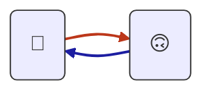
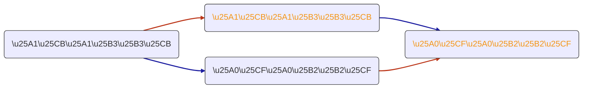
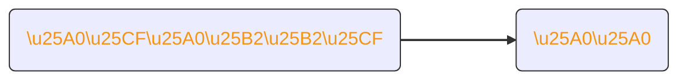
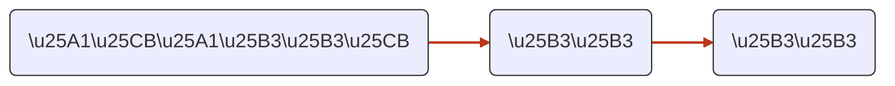
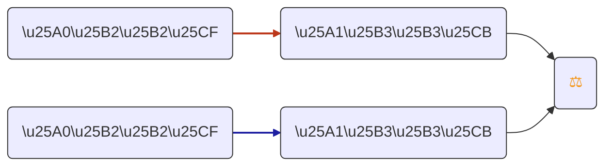

# Use it at https://mermaid.live/
# download svg locally (need to try the plugin)

## Theme for all diagrams 
{
  "theme": "default",
  "themeVariables": { "edgeLabelBackground":"#FF"}
}

---
Unicode cheat : https://www.compart.com/fr/unicode/block/U+25A0

carré plein: \u25A0
carré vide: \u25A1

triangle plein: \u25B2
triangle vide: \u25B3

rond plein: \u25CF
rond vide : \u25CB

face up : \u1F642
face down : \uF643

---
## Round Tripping 

---
## Diagram Commutativity

---
## Diagram Invariant 

---
## Diagram idempotence 

---
## Diagram Oracle  

