# Use it at https://mermaid.live/
# download svg locally (need to try the plugin)

## Theme for all diagrams 
{
  "theme": "default",
  "themeVariables": { "edgeLabelBackground":"#FF"}
}

---
Unicode cheat : https://www.compart.com/fr/unicode/block/U+25A0

carré plein: \u25A0
carré vide: \u25A1

triangle plein: \u25B2
triangle vide: \u25B3

rond plein: \u25CF
rond vide : \u25CB

face up : \u1F642
face down : \uF643

---
## Round Tripping 

```mermaid
flowchart LR
    A("🙂") -->B("🙃")
    B --> A

    style A stroke:#333,stroke-width:1px
    style B stroke:#333,stroke-width:1px
    linkStyle 0 stroke:#bc371a,stroke-width:2px;
    linkStyle 1 stroke:#1d1ea1,stroke-width:2px;
```

---
## Diagram Commutativity

---
## Diagram Invariant 

---
## Diagram idempotence 

---
## Diagram Oracle  

```mermaid
flowchart LR
    A1("\u25A0\u25B2\u25B2\u25CF") --> B1("\u25A1\u25B3\u25B3\u25CB") --> C("⚖️")
    A2("\u25A0\u25B2\u25B2\u25CF") --> B2("\u25A1\u25B3\u25B3\u25CB") --> C

    style A1 stroke:#333,stroke-width:1px
    style B1 stroke:#333,stroke-width:1px
    style A2 stroke:#333,stroke-width:1px
    style B2 stroke:#333,stroke-width:1px

    style C stroke:#333,stroke-width:1px,color:#f49515

    linkStyle 0 stroke:#bc371a,stroke-width:2px;
    linkStyle 2 stroke:#1d1ea1,stroke-width:2px;
```

